# Project 4 - Sneaker-Dom

## Overview
The final project of the GA Software Engineering Immersive and one that I decided to take on as a solo project. I was tasked with creating a full-stack application that includes "one to many" and "many to many" relationships.

One of my passions is collecting Sneakers. For this reason I decided to create a Sneaker website with the purpose of collaborating collections with others. One of the dilemmas I often have as a "Sneakerhead" is knowing which sneaker I would keep, essentially to display, and which I would be comfortable using for their intended purpose. This website would allow users to comment on sneakers as well as display a "last known price" to be able to gauge the value of the sneaker.

This project has been deployed using Heroku, view <a href=”https://sneaker-dom.herokuapp.com/” target=”_blank”>here</a>

## Brief
The final project of the GA Software Engineering Immersive, I was tasked with creating a full-stack application that includes "one to many" and "many to many" relationships.

- Create a full stack application with a React frontend and a Django backend

**Timeframe: 8 days**

## Technologies Used

 - Python
 - Django
 - React
 - Cloudinary
 - Heroku

## Instructions for Use
### Login and Register
For users of the site to register and login. This will give them authorisation to comment on sneakers. Future functionality will allow users to also add their own sneakers.

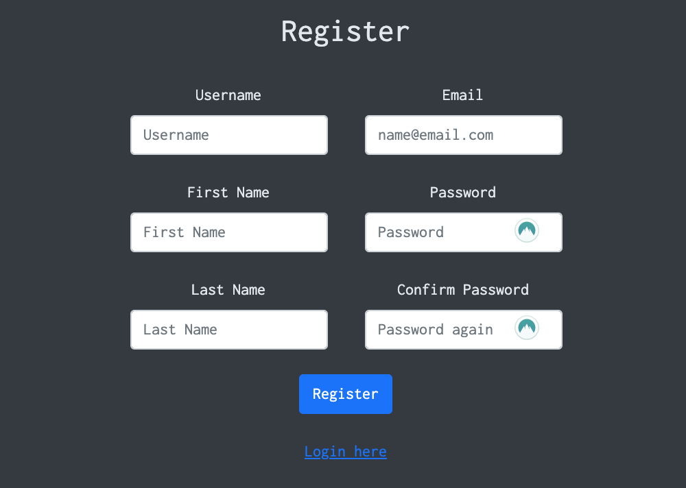
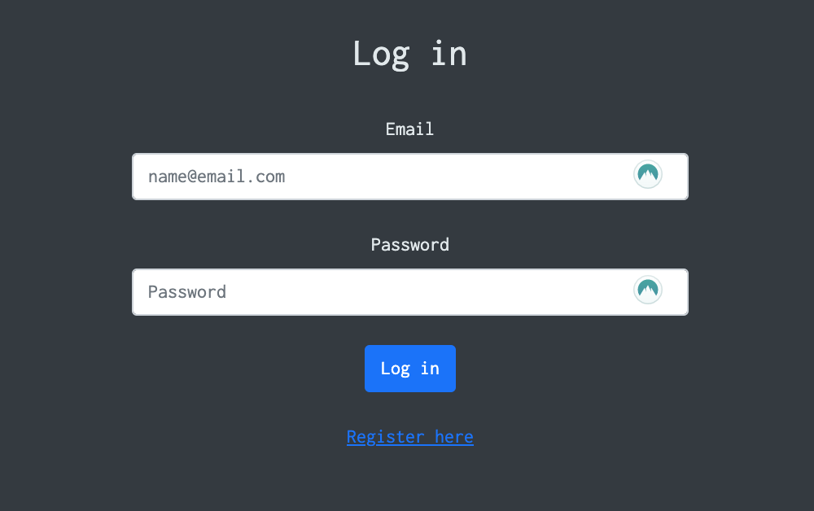

### Index page
This page displays the many to many relationships interacting to show certain sneakers. Users can use the React multi select bar to click or type colours of sneakers that they want displayed.

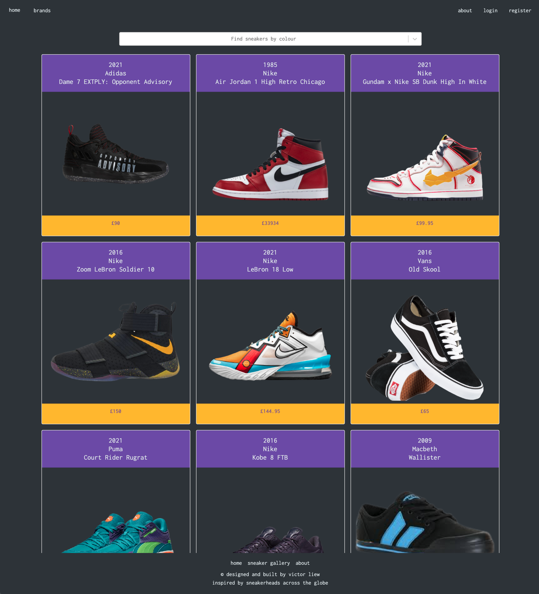

### Sneaker page
Page showing the up to date information of a sneaker, from the description to the original release year and last known price.
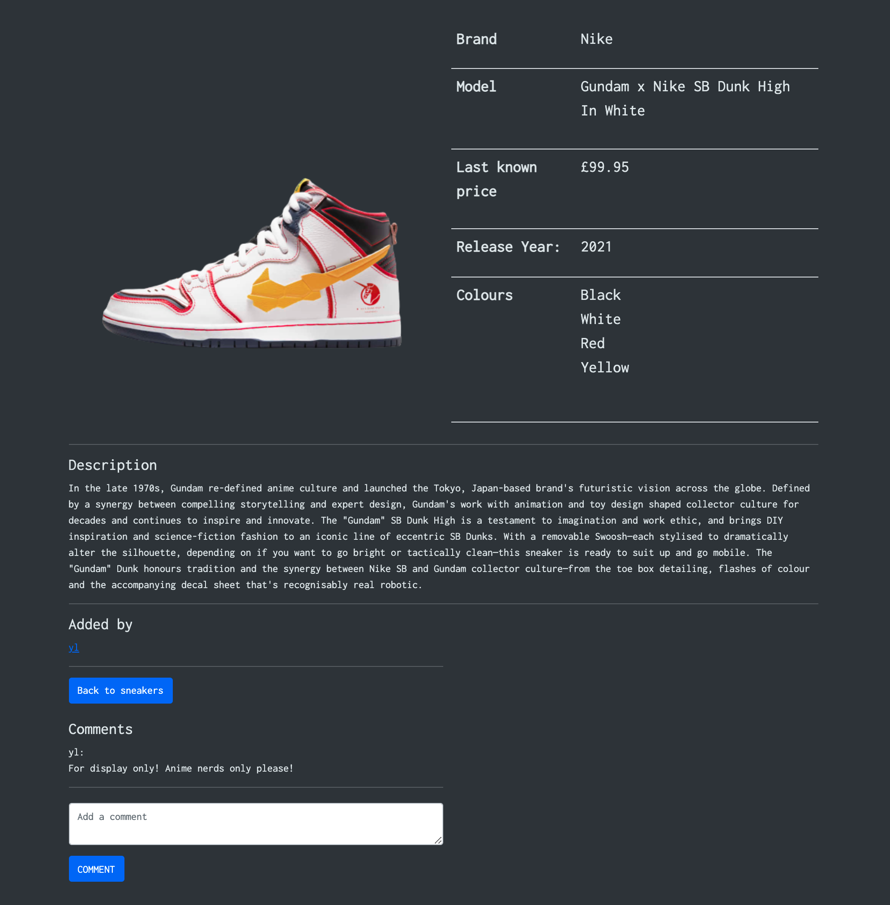

### Comment section
For users to comment and review on sneakers, giving their opinions on trending sneakers.
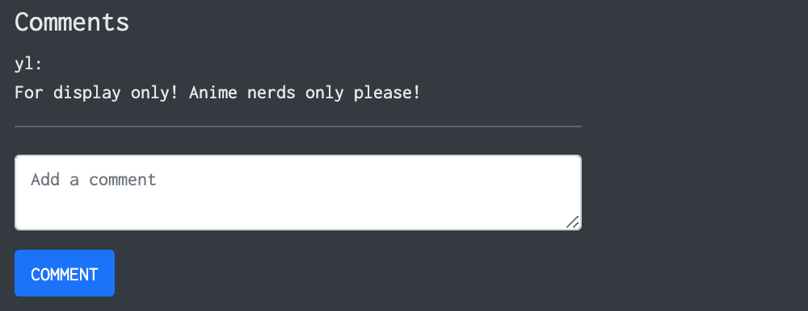

## Planning Process

Day 1 of the project was used for the planning stages. The first step was to create a database diagram displaying the "one to many" and "many to many" relationships. In order to better display this, I used QuickDBD to create an Entity Relationship Diagram.

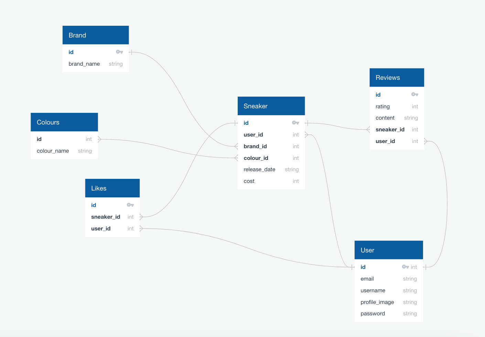

Once this was done, I used Jamboard to create a wireframe of what I would want my app to look like and have a visual for what I would want to link and to where.

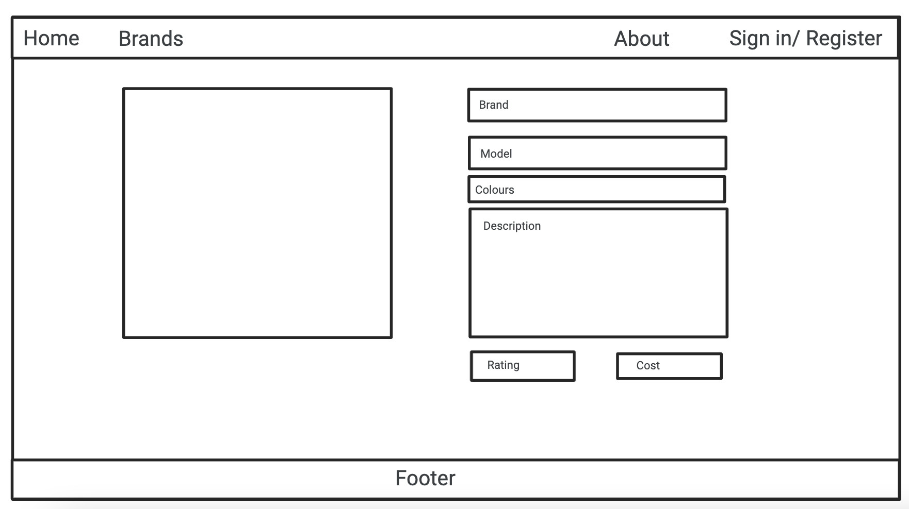

## Backend

I started coding on the second day of the project, after the planning stage was completed. Starting with the backend I created "jwt_auth", "colours", "sneakers", "reviews". The order was important as, for example, a review cannot exist with a sneaker. Similarly, creating sneakers before colours would mean the colour can not be assigned to the sneaker without reseeding.

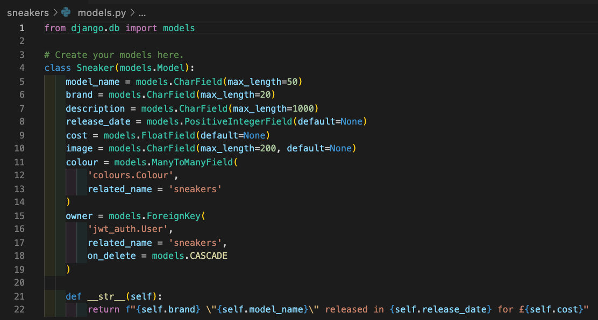

### Users
The list of users that are part of the app, including whether the user is a “super user” (admin account)

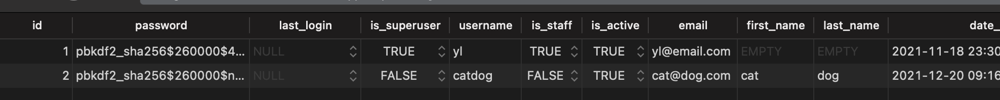

### Sneakers
A user can be an owner of a sneaker.

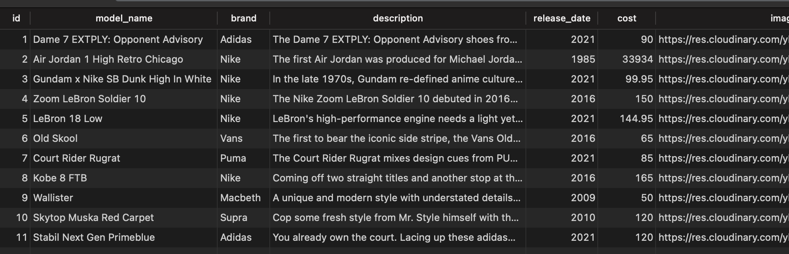

### Reviews
Reviews are attached to a specific sneaker.

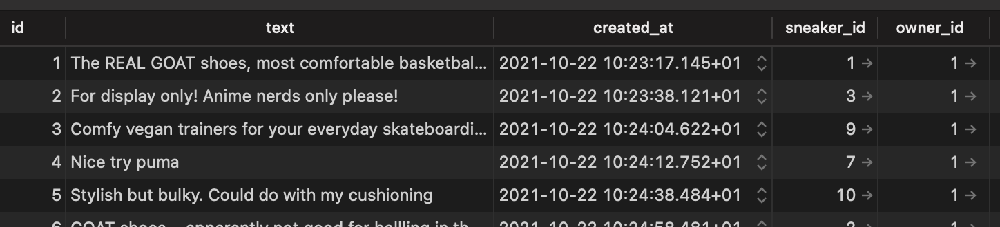

### Colours
The list of colours display a many to many relationship as one sneaker may have many different colours, subsequently one colour may be assigned to many different sneakers.

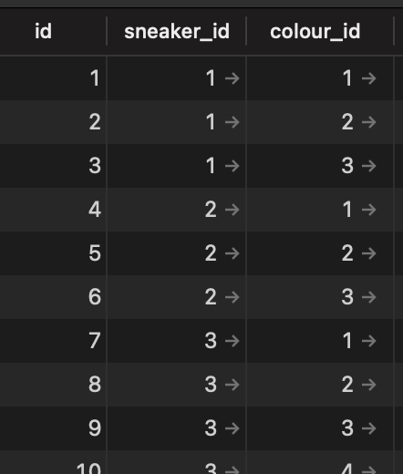

### API Calls
API calls played a key part to retrieving data for this app. A list of API calls that I built in the backend include:

- GET all sneakers
- GET single sneaker
- POST (add) sneaker - to add new sneakers to the database
- DELETE single sneaker
- PUT (edit) sneaker - to edit sneaker attributes (colours)
- GET review
- POST review - add a review to a sneaker
- DELETE review
- GET colours

## Frontend

Whilst creating the frontend with React, fleshing out the main components was relatively comfortable. One of the trickier parts to deal with was the comments section. Whilst I was able to get new comments to display they would often display without the poster's username. 
After spending a while on this issue I decided to come up with a “work around” solution of forcing a page reload using “location.reload()” which would re render the page and display the username alongside the comment. Ultimately this is a problem that I could come back to, however, given the time restraints I felt that this “stop gap” made the most sense.

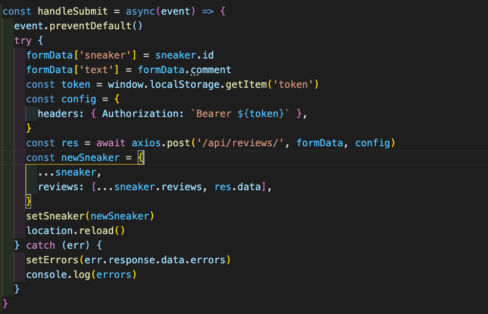

Upon coding the SneakerIndex page I came across an error, something was stopping the required information from showing, despite the code in SneakerIndex and SneakerCard page suggesting that it should. Using the chrome inspect tool it was clear that the data was being sent, however, it was not displaying.
After some error handling a solution that I came up with was to remove the useState and useEffect on the SneakerCard.js file as it seemed that there was potentially a timing issue which meant that the data wouldn’t be displayed.
This in turn would mean that I would have to pass props in order to extract the required information. As the backend was set up with Python the objects were in snake case. The frontend using React, being JavaScript based, required the identifiers to be written in camel case. To get around this issue I used a simple solution e.g. instead of model_name iI used model_name: modelName.

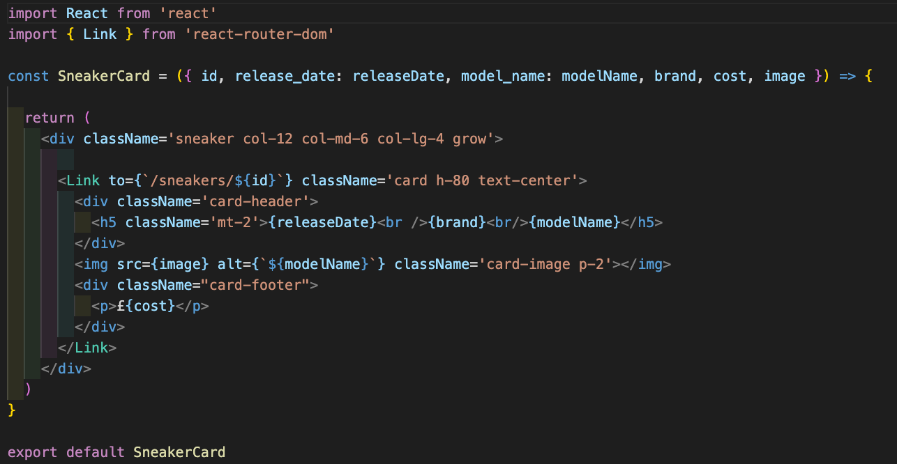

To create the general structure of the app I decided to use Bootstrap styling as I believed that this would cut down the amount of time needed on styling which would allow me to take more time coming up with code solutions.

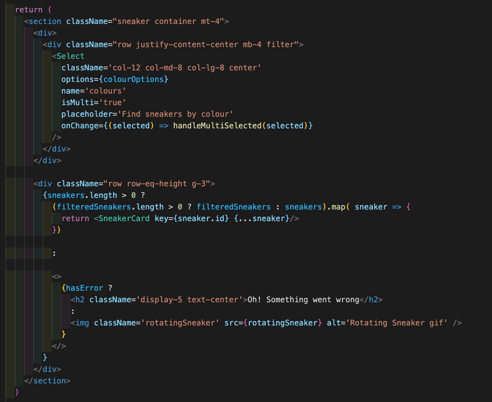

### Results
Overall I am pleased with the design and functionality of the app, although there were a few bugs and noticeable improvements that could be made. Working to a deadline placed constraints on my ability to complete the app to where I would have liked it to be. One of the biggest challenges was when a dependency was upgraded by mistake, resulting in a significant amount of time lost troubleshooting which should have been used for development instead. Despite this I now feel confident in my ability to be able to put together a fully-functioning app.

## Known Errors/Bugs:
I have included "toast notifications" in the code, however, getting this to display has proven tricky. For example, upon login the page re-renders which does not give the toast notification the time to pop-up.

## Wins/ Challenges:
### Wins:
- I'm really pleased at the aesthetics of the site as it gives a sleek clean feel whilst navigating through each page.
- Coming up with work around solutions to reach a minimum viable product.

### Challenges:
- On the penultimate day of the project, my laptop would no longer run code. There was a backend issue, data was being sent but would not be displayed for a seemingly unexplainable reason.
A work-around I had to implement was the use of "Ngrok" which would expose the local backend to the internet, therefore allowing the data that I had seeded to display when called. I later learned that the node.js version on my laptop had updated which was the cause of all the issues I had. Whilst a seemingly small problem, this halted my ability to progress on my project for over a week.
- Positioning and resizing the carousel proved more difficult than expected, possibly leading to overcomplicating the process of styling.

## Future Features
- At present, it is possible for users to leave comments on sneakers, however, the functionality to add their own sneakers has not been set up. This is an integral part of the site and would be the next component on the list of things to be added.
- Adding the ability to like or dislike certain sneakers.

## Key Learning
- Pay close attention to updates that occur, taking note of exactly what is being updated (particularly when using Brew). Run checks to see if code works after updates are made.
- Setting targets to achieve building a minimum viable product.
- Asking for help when needed, even if it's to get a push in the right direction.
